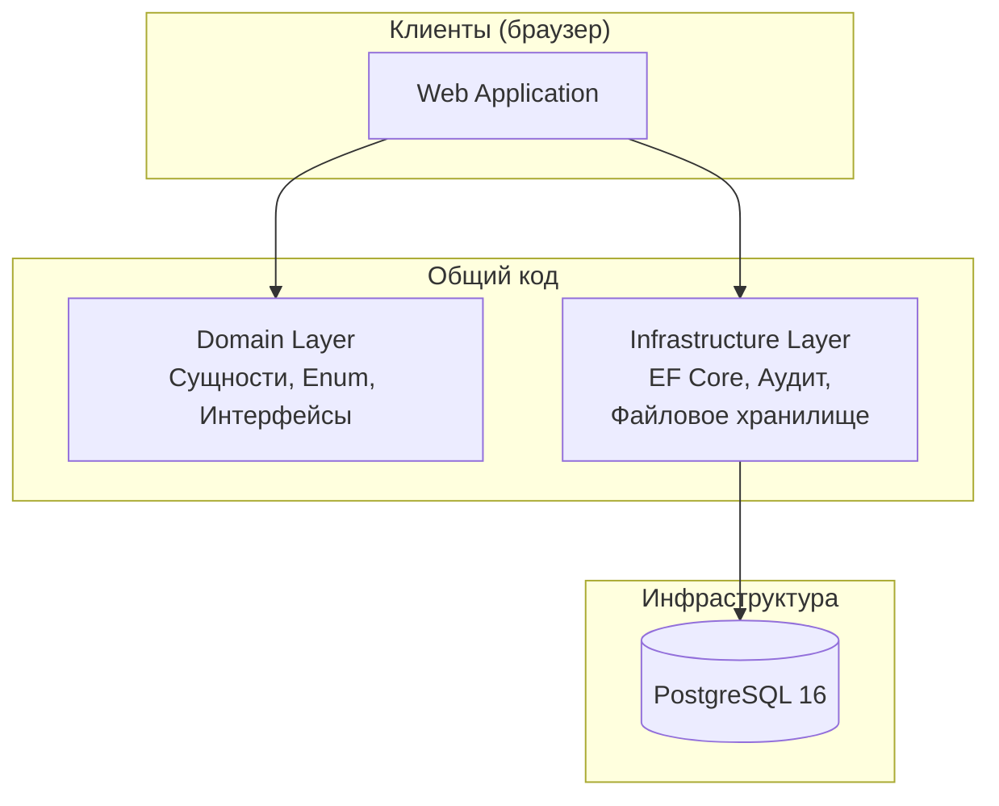
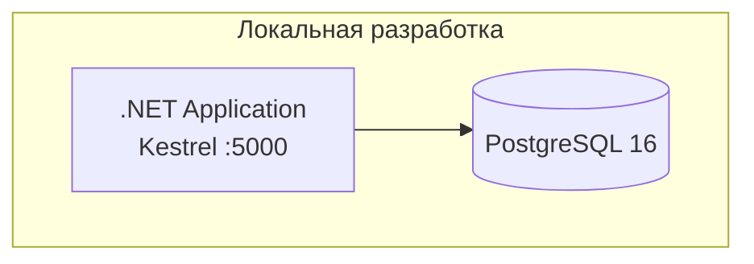

# Архитектура проекта Mnemonios

---

## Обзор

Платформа построена по принципам чистой архитектуры: приложение разделяет общий доменный слой и инфраструктуру.

---

## Архитектурные принципы

| Принцип | Описание |
|---------|----------|
| **Чистая архитектура** | Зависимости направлены внутрь — Api → Application → Domain ← Infrastructure |
| **Domain-Driven Design** | Моделирование через доменные сущности, ограниченные контексты |
| **SOLID** | Соблюдение всех пяти принципов |
| **Database-First** | Схема БД ведётся одним каноническим SQL (BDR-002) |

---

## Общая архитектура



---

## Структура проекта

```
SamorodinkaTech.Mnemonios/
├── src/
│   ├── Api/                        # ASP.NET Core Minimal API (эンドпоинты, Program.cs)
│   ├── Domain/                     # Доменный слой
│   │   ├── Entities/               # Сущности (Person, PersonIdentificationKey, PersonExternalId, PersonDefect, PersonDeferredCessation)
│   │   ├── Enums/                  # Перечисления (PersonMatchStatus)
│   │   ├── Interfaces/             # Абстракции (IPersonRepository, IPersonResolveService)
│   │   ├── Validation/             # Серверная валидация (PersonResolveValidator)
│   │   └── DTOs/                   # Модели запросов/ответов
│   ├── Infrastructure/             # Инфраструктурный слой
│   │   ├── Persistence/            # EF Core DbContext + конфигурации (snake_case маппинг)
│   │   └── Services/               # Реализации (NormalizationService, IdentificationKeyService,
│   │                               #   PersonRepository, PersonResolveService)
│   └── Common/                     # Общие утилиты
├── tests/
│   ├── Unit/                       # Unit тесты (xUnit + Moq + FluentAssertions 6.12.0)
│   └── Integration/                # Integration тесты (WebApplicationFactory)
├── docs/                           # Документация
│   ├── architecture.md             # Этот файл
│   ├── eedin/                      # Документация модуля ЕДИН
│   └── decision_records/           # Architecture Decision Records
├── tools/
│   └── db/                         # SQL-скрипты (01_schema.sql, 00_reset, 02_seed)
├── docker-compose.yml              # PostgreSQL 16
├── AGENTS.md                       # Правила проекта
└── CONTRIBUTING.md                 # Руководство контрибьютора
```

---

## Доменные модули

### ЕДИН — Master Person Index (MPI)

Подробное описание модуля: [docs/README.md](README.md)

| Компонент | Описание |
|-----------|----------|
| **NormalizationService** | Нормализация ФИО, ИНН, СНИЛС, ДУЛ (trim, collapse, NFC, uppercase) |
| **IdentificationKeyService** | Вычисление HMAC-SHA256 ключей для детерминированного сопоставления |
| **PersonResolveService** | Основной алгоритм идентификации (Matched/Unmatched/Conflict) |
| **PersonRepository** | CRUD операции с транзакционной поддержкой (BDR-015) |
| **PersonResolveValidator** | Серверная валидация (ИНН, СНИЛС, обязательные поля) |

Подробнее: [docs/eedin.md](eedin.md)

---

## Требования к производительности

| Метрика | Целевое значение |
|---------|------------------|
| Latency API (p95) | < 200ms |
| Latency API (p99) | < 500ms |
| Concurrent Users | 1000 |
| Data Availability | 99.9% |

---

## Схема развёртывания


