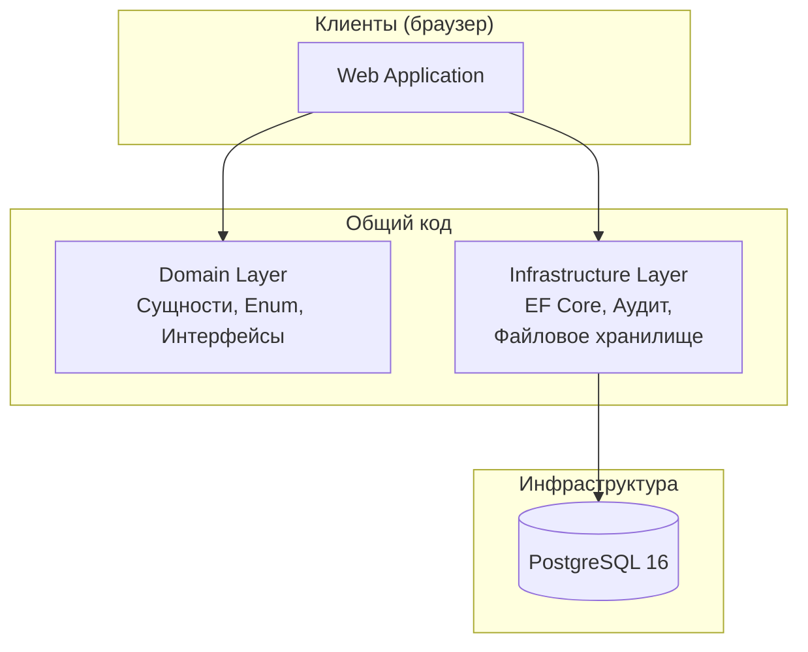
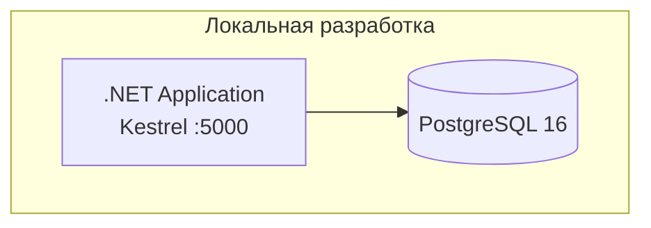

# Архитектура проекта Mnemonios

---

## Обзор

Платформа построена по принципам чистой архитектуры: приложение разделяет общий доменный слой и инфраструктуру.

---

## Архитектурные принципы

| Принцип | Описание |
|---------|----------|
| **Чистая архитектура** | Зависимости направлены внутрь — Api → Application → Domain ← Infrastructure |
| **Domain-Driven Design** | Моделирование через доменные сущности, ограниченные контексты |
| **SOLID** | Соблюдение всех пяти принципов |
| **Database-First** | Схема БД ведётся одним каноническим SQL (BDR-002) |

---

## Общая архитектура



---

## Структура проекта

```
SamorodinkaTech.Mnemonios/
├── src/
│   ├── Applications/             # Исполняемые проекты
│   │   ├── Api/                  # ASP.NET Core Minimal API (эンドпоинты)
│   │   ├── Steward/              # ASP.NET Core Razor Pages (АРМ стюарда)
│   │   ├── Worker/               # Фоновые задачи (планировщик)
│   │   └── Proxy/                # Proxy-сервис: хеширование ПДн на стороне источника
│   └── Core/                     # Библиотеки
│       ├── Domain/               # Доменный слой
│       │   ├── Entities/         # Сущности
│       │   ├── Enums/            # Перечисления
│       │   ├── Interfaces/       # Абстракции (порты)
│       │   ├── Validation/       # Серверная валидация
│       │   └── DTOs/             # Модели запросов/ответов
│       ├── Infrastructure/       # Инфраструктурный слой
│       │   ├── Persistence/      # EF Core DbContext + конфигурации
│       │   ├── Services/         # Реализации сервисов
│       │   ├── Middleware/       # ExceptionLoggingMiddleware
│       │   └── Common/           # ExceptionFlattener
│       └── Common/               # Общие утилиты
├── tests/
│   ├── Unit/                     # Unit тесты (xUnit + Moq + FluentAssertions)
│   └── Integration/              # Integration тесты (WebApplicationFactory)
├── docs/                         # Документация
│   ├── architecture.md           # Этот файл
│   └── decision_records/         # Architecture Decision Records
├── tools/
│   └── db/                       # SQL-скрипты (01_schema.sql, 00_reset, 02_seed)
├── docker-compose.yml            # PostgreSQL 16 + Api + Worker + Steward + Proxy
├── AGENTS.md                     # Правила проекта
└── CONTRIBUTING.md               # Руководство контрибьютора
```

---

## Доменные модули

### ЕДИН — Master Person Index (MPI)

Подробное описание модуля: [docs/README.md](README.md)

| Компонент | Описание |
|-----------|----------|
| **NormalizationService** | Нормализация ФИО, ИНН, СНИЛС, ДУЛ (trim, collapse, NFC, uppercase) |
| **IdentificationKeyService** | Вычисление HMAC-SHA256 ключей для детерминированного сопоставления |
| **PersonResolveService** | Основной алгоритм идентификации (Matched/Unmatched/Ambiguous) + автозакрытие конфликтов |
| **PersonHashResolveService** | Идентификация по предвычисленным хешам (для proxy-сервиса) |
| **PersonMergeService** | Слияние двух персон: перенос ключей, внешних ID, документов в выживающую запись |
| **PersonRepository** | CRUD операции с транзакционной поддержкой (BDR-015) |
| **PersonResolveValidator** | Серверная валидация (ИНН, СНИЛС, обязательные поля) |

---

## Паттерны записей MPI

Архитектура ЕДИН MPI основана на двух типах записей, каждый из которых выполняет свою роль:

### Surrogate / Reference Records (адресация)

**Назначение:** знать, куда именно (в какую внешнюю МИС или ЛИС) нужно сходить по API, чтобы динамически собрать «золотую» карточку реальными данными в момент запроса.

Хранят только Source System ID, Local Patient ID и системные суррогатные ключи.

| Таблица | Роль |
|---------|------|
| `persons` | Master Identifier — уникальный `PersonID` (UUID) для каждого физического лица |
| `person_external_ids` | Связи с внешними системами: `sourceSystemId` + `externalPersonId` + `externalPersonType` |

Эти записи **не содержат ПДн** — они отвечают за адресацию: «лицо X в системе Y имеет идентификатор Z».

### Shadow Records (интеллект сопоставления)

**Назначение:** хранить вычисленные кэши и детерминированные хеши, которые позволяют движку MPI мгновенно «склеивать» записи без обращения к тяжёлым исходным базам данных.

Хранят HMAC-SHA256 хеши, нормализованные данные и другие вычисленные атрибуты.

| Таблица | Роль |
|---------|------|
| `person_identification_keys` | HMAC-SHA256 ключи идентификации (`inn`, `snils`, `dul`, `inn_fio`, `snils_fio`, `dul_fio`) |
| `person_documents` | Хеши документов (ДУЛ) для дополнительного сопоставления |

Эти записи весят «копейки», но позволяют движку MPI мгновенно определять: «это та же персона или нет?» — без обращения к внешним системам.

### Взаимодействие паттернов

```
Запрос от внешней системы
        │
        ▼
┌───────────────────┐     ┌───────────────────┐
│  Shadow Records   │────▶│  Surrogate/Ref    │
│  (хеши, ключи)    │     │  (адресация)      │
│                   │     │                   │
│  Быстрый поиск:   │     │  Ответ:           │
│  «кто это?»       │     │  «где данные?»    │
└───────────────────┘     └───────────────────┘
        │                         │
        ▼                         ▼
   Matched /              Динамическое получение
   Unmatched /            данных из внешних
   Ambiguous              систем по API
```

---

## Требования к производительности

| Метрика | Целевое значение |
|---------|------------------|
| Latency API (p95) | < 200ms |
| Latency API (p99) | < 500ms |
| Concurrent Users | 1000 |
| Data Availability | 99.9% |

---

## Схема развёртывания


